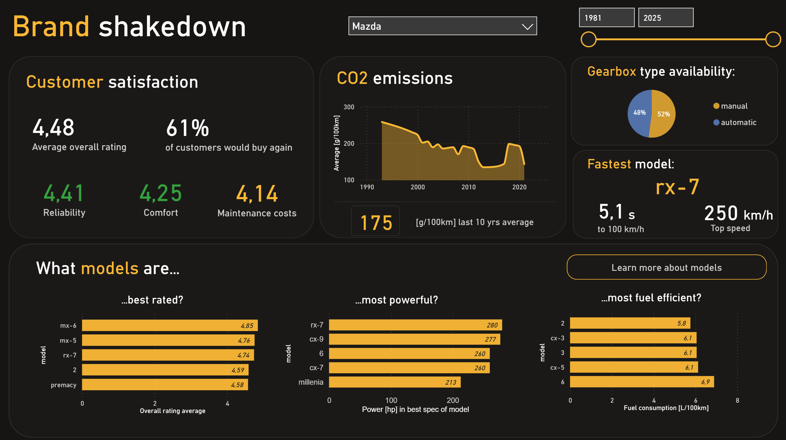
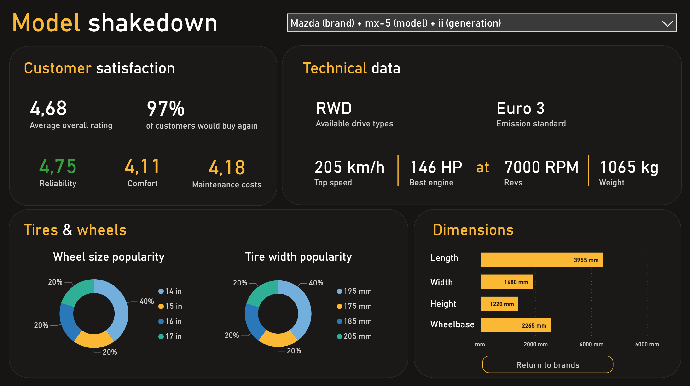

# Car Data Analysis Project

A Python project for scraping and analyzing car technical specifications and user reviews from autocentrum.pl. The project includes web scraping, data analysis & cleaning, database integration and data visualization.

## Project Structure

```bash
├── src/
│ ├── data/					     # Scraped data storage
│    ├── car_technical_data/ 	 # JSON files with car specs
│    ├── car_model_links.txt 	 # URLs to car models
│    ├── car_ratings.txt 		 # User ratings data
│    └── cars.db                 # Cars database
│ ├── data_scripts/ 			 # Data processing scripts
│    ├── database.py			 # Database loading scripts
│    └── preliminary_ed.ipynb 	 # Data exploration notebook
│ └── scraper/ 				     # Web scraping modules
│ 	 ├── links_scraper.py		 # Car model URLs scraper
│ 	 ├── tech_data_scraper.py 	 # Technical specs scraper
│ 	 └── review_data_scraper.py  # User reviews scraper
└── main.py 					 # Main execution script
```

## Features

- Scrapes comprehensive car technical specifications
- Collects user ratings and reviews
- Handles data cleaning and preprocessing
- Stores data in structured JSON and CSV formats
- Database integration for cleaned data

## Usage

1. Install requirements:

```bash
pip install -r requirements.txt
```

2. Run the main script to collect data:

```bash
python main.py
```

3. Explore and clean the data
   Open:

```bash
src/data_scripts/preliminary_ed.ipynb
```

4. Load cleaned data into SQLite
   Automatically handled via:

```bash
src/data_scripts/database.py
```

5. Use the cleaned database in Power BI
   Located in:

```bash
src/data/cars.db
```

## Data Sources

The project scrapes data from autocentrum.pl including:

* Technical specifications for different car models
* User ratings across multiple categories
* Car model information and generations

Clean data is saved into a database located in the folder data.

## Power BI Dashboard

The project includes a comprehensive two-page Power BI dashboard built using the cleaned and structured data stored in the SQLite database.

### 1. Brand Shakedown

Brand-level comparison and technical overview.

Includes:

* KPI Cards - Customer satisfaction, fastest model
* Line Chart - CO₂ emissions over time
* Pie Chart - Driveline type availability
* Bar Charts - Top car models by: overall customer rating, power [hp], fuel efficiency



### 2. Model Shakedown

Detailed analysis of individual car models.

Includes:

* KPI Card - Customer satisfaction for selected model
* Donut Charts - Wheel & Tire sizes
* Technical Data KPIs - drive types, emission standards, top speed, engine power and rpm, curb weight
* Bar Chart - Car dimensions (length, width, height, wheelbase)



## Technologies Used

* Python
* requests, BeautifulSoup4 - web scraping
* pandas, numpy - data cleaning and preprocessing
* sqlite3 - relational database
* json, csv - structured data storage
* jupyter - exploratory data analysis
* Power BI
* Data modeling
* DAX measures
* KPI cards & interactive visualizations
* Dashboard/report design

## What I Learned (Project Summary)

### Web Scraping

* Building modular scrapers (links, tech data, reviews)
* Handling pagination, request delays, and inconsistent HTML structure
* Extracting structured data from real-world websites

### Data Engineering

* Cleaning and normalizing raw datasets
* Transforming JSON → DataFrame → SQL tables
* Designing a relational SQLite database
* Automating ETL processes with Python

### Exploratory Data Analysis (EDA)

* Detecting missing values, outliers, and duplicates
* Understanding distributions and relationships between variables
* Preparing data for BI usage

### Business Intelligence

* Creating KPIs and DAX measures
* Designing interactive charts (line, bar, pie, donut)
* Combining technical specifications and user ratings in one report

### Software Engineering

* Writing readable, modular, scalable code
* Following project structure conventions
* Documenting the workflow and results

## Overall Summary

This project showcases an end-to-end data pipeline:

Scraping → Cleaning → Database → Power BI Visualization

It demonstrates strong abilities in:

* Python development
* Data engineering & ETL
* SQL database creation
* Business Intelligence reporting
* Visualization & analytical storytelling
* Working with unstructured, real-world data

## Note

This project is for educational purposes. Please respect the website's robots.txt and implement appropriate delays between requests when scraping data.
